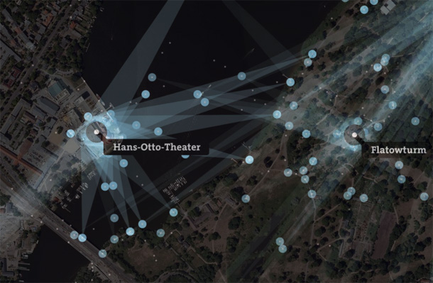



Shows a static image laid over an interactive background map. The north-west and south-east boundaries of the image are used to position and scale the image.

In this example, the image shows from where people take pictures of famous sights. The visualization is laid over a satellite map. Below, you can see how people photograph the Hans-Otto-Theater in Potsdam, Germany.

This example is using a generated image from [Splendor](http://schwinki.de/splendor/).
