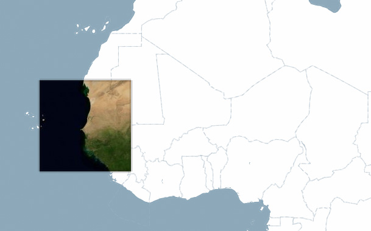



A small map is laid atop the interactive background map. The overlay map shows the satellite view, while the background map shows a simplified map. Interaction is reflected in both maps, so the overlay map acts as an interactive window to another map layer.

Demonstrates how to position a second map according to its position on the background map.

