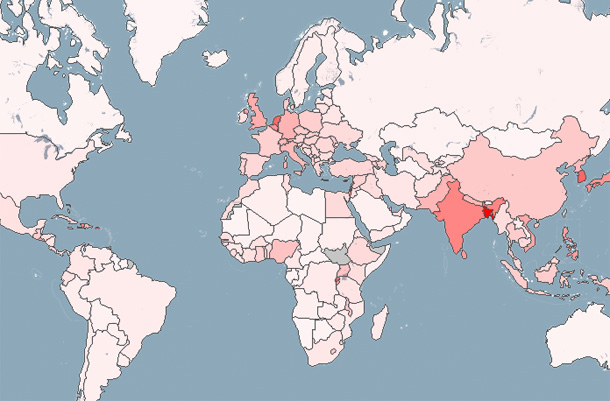



Visualizes population density of the world as a choropleth map. Countries are shaded in proportion to the population density.

It loads the country shapes from a GeoJSON file via a data reader, and loads the population density values from another CSV file (provided by the World Bank). The data value is encoded to transparency via a simplistic linear mapping.

