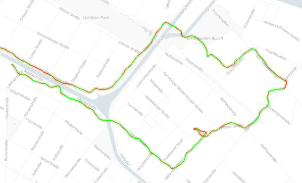



Displays a track loaded from a GPX file containing a bike tour in Berlin. The current speed is shown as the color of the path segment, with red representing slow and green representing fast speeds.

