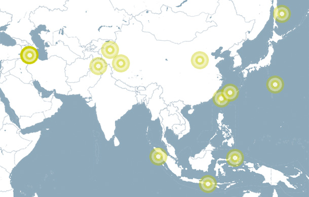



Displays earthquakes from an RSS feed. Geo-locations are read, and mapped manually according to current map transformation.

(Not using Features, GeoDataReader, nor Marker and MarkerManager.)

Earthquake icons are not cut off at the border of the map. So, this simple mechanism only works for single full-canvas maps. If you have maps placed on the canvas, or multiple ones, or other more sophisticated usages look into examples with MarkerManager, e.g. InfoMarkerApp.

