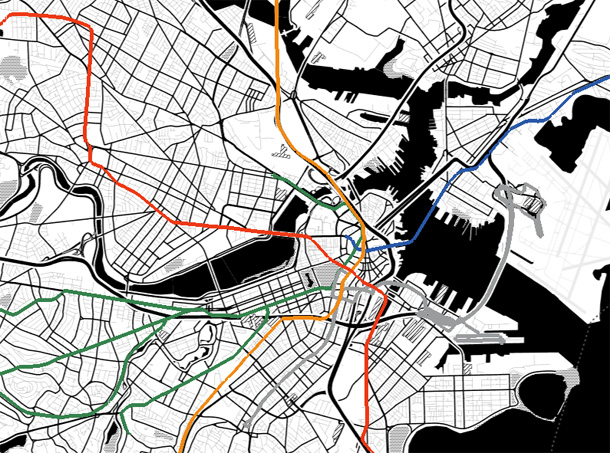



Displays the subway lines of Boston, read from a GeoJSON file.

This example shows how to load data features and create markers manually in order to map specific properties; in this case the colors according to the MBTA schema.

