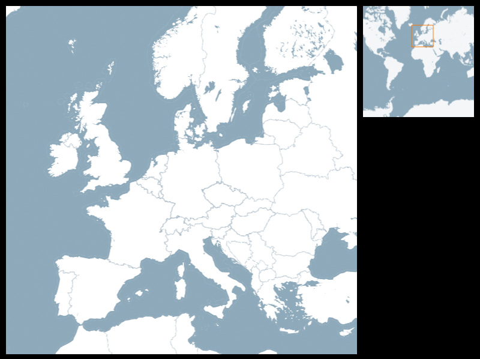



Shows an navigable detail map, and a static overview map with a viewport. The area in the detail map is shown as finder rectangle (aka viewport) in the overview map. The finder can be dragged around.
 
This Overview + Detail example shows how to use custom interaction without relying on Unfolding's internal event mechanism.

