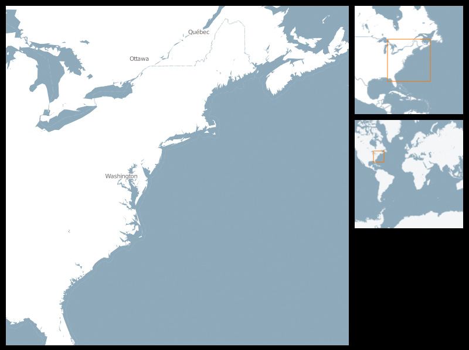



Three maps are shown: One large navigable detail map, and two overview maps. The currently selected area in the detail map is shown as finder rectangle in the overview maps. One overview map always shows the whole world, with its finder rectangle changing size on zoom. The other overview map shows the same view in another zoom level, with its finder rectangle keeping its size.
 
This Overview + Detail example shows how to setup connected map views.

