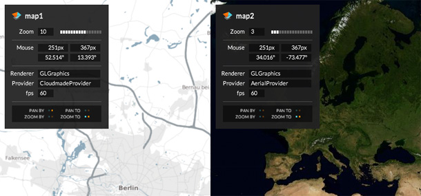



Displays various information about the map. It shows the current state of the map (e.g. zoom level), the position of the mouse pointer (e.g. geo-location), and some general information (e.g. the map tile provider).

In the lower area of the widget you see map events such as zoom and pan in real-time. This can be useful to debug more complex interaction connections between maps, e.g. for an Overview + Detail scenario.

This example uses DebugDisplays to show information about two independent maps from different providers.

