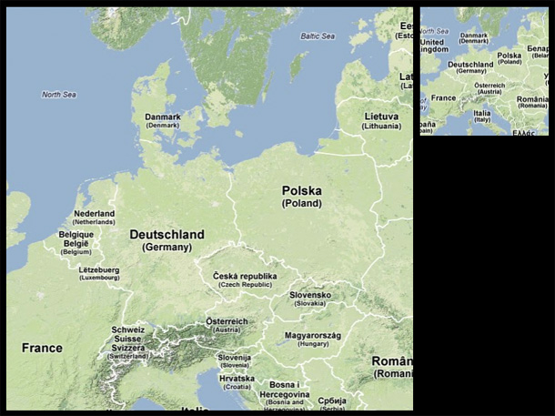



Two maps are shown side by side: The overview is a small-scale map, and shows the same area as the large-scale detail map.
Both maps are interactive, and can be navigated. Each interaction is reflected in both maps.

This Overview + Detail example shows how to setup simple connected map views.

	public class OverviewAndDetailMapApp extends PApplet {
		
		UnfoldingMap mapDetail;
		UnfoldingMap mapOverview;
		
		public void setup() {
			size(800, 600, GLConstants.GLGRAPHICS);

			mapDetail = new UnfoldingMap(this, "detail", 10, 10, 585, 580);
			mapOverview = new UnfoldingMap(this, "overview", 605, 10, 185, 185);

			EventDispatcher eventDispatcher = new EventDispatcher();

			// Add mouse interaction to both maps
			MouseHandler mouseHandler = new MouseHandler(this, mapDetail, mapOverview);
			eventDispatcher.addBroadcaster(mouseHandler);

			// Maps listen to each other, i.e. each interaction in one map is reflected in the other
			eventDispatcher.register(mapDetail, "pan", mapDetail.getId(), mapOverview.getId());
			eventDispatcher.register(mapDetail, "zoom", mapDetail.getId(), mapOverview.getId());
			eventDispatcher.register(mapOverview, "pan", mapDetail.getId(), mapOverview.getId());
			eventDispatcher.register(mapOverview, "zoom", mapDetail.getId(), mapOverview.getId());
		}

		public void draw() {
			background(0);

			mapDetail.draw();
			mapOverview.draw();
		}
	}

See also other examples, such as [Overview+Detail with Finder Box](overViewAndDetailFinder.md).

