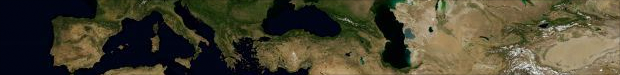
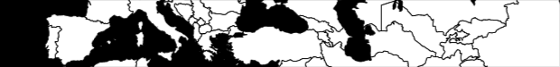



Let's begin with our basic Unfolding sketch.

You already have installed Unfolding for your programming environment. (Otherwise, do it now: [Unfolding for Processing](getting-started-in-processing.html) or [Unfolding for Eclipse](getting-started-in-eclipse.html).)

	UnfoldingMap map;
	
	void setup() {
  		size(800, 600, GLConstants.GLGRAPHICS);
  		map = new UnfoldingMap(this);
  		MapUtils.createDefaultEventDispatcher(this, map);
	}
	
	void draw() {
		map.draw();
	}

## Geolocations and screen positions

You can easily convert a screen position to a location, and vice versa. As an example, let's display the geo-position of the mouse pointer.

Here, we get the Location of the map at the current mouse position, and show its latitude and longitude as black text.

	Location location = map.getLocation(mouseX, mouseY);
	fill(0);
	text(location.getLat() + ", " + location.getLon(), mouseX, mouseY);

## Map styles

Unfolding displays maps in a default style, with cartographic data from OpenStreetMaps and tiles from Cloudmade. To use another map style, simply specify it as second parameter when constructing an UnfoldingMap.

	map = new UnfoldingMap(this, new Microsoft.AerialProvider());
	
(Don't forget importing `de.fhpotsdam.unfolding.providers.*`)

This way, you can easily switch to one of the pre-configured map tile providers. To see the different map styles, go to the [MapProvider & Tiles tutorial](). There you'll also find how to create your own map provider, and even how to create a completely new map style.

  

Keep in mind you need to check the terms and conditions of the map providers on how you are allowed to use their map tiles. We are providing the example providers for educational purposes, only.

## Zooming and panning the map

By creating the default event dispatcher (as shown above), users already can interact with your map. They can pan the map by dragging it with the mouse, or by using the arrow keys on the keyboard. Using the mouse wheel zooms in or out, which also works by pressing + or - keys. Double-clicking on the map centers it around that location, and zooms in one level. 

Now, let's say you want to focus your visualization on a city. Manually set the location and zoom level in the setup() method.

	map.zoomAndPanTo(new Location(52.5f, 13.4f), 10);

Here, we pan to Berlin and zoom to a level users can see the whole city area.

You might want to restrict the map interactions, for instance because you only have data for a specific area.
For that, we create a Location for the city, and use it to center the map (as before), but we are using that Location also as center for the panning restriction. Users now can drag the map only for 30 km around the city center.
	
	Location berlinLocation = new Location(52.5f, 13.4f);
	map.zoomAndPanTo(berlinLocation, 10);
	float maxPanningDistance = 30; // in km
	map.setPanningRestriction(berlinLocation, maxPanningDistance);

See the [Interactions tutorial](interactions-simple.html) for more map interactivity, such as how to jump to different locations, or how to animate the map.

## Marker

## More information

Now, check out our other [tutorials](./), e.g. how to use [multiple maps](multi-maps.html) in one sketch.

Don't forget to take a look at the [API documentation](../javadoc/), and at our [examples](../examples/).
