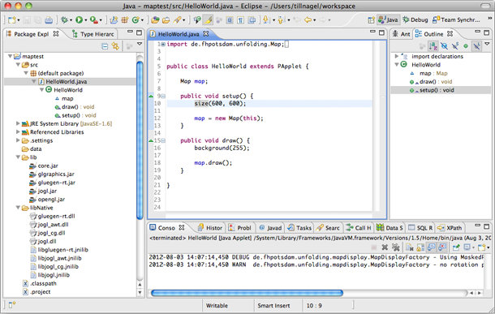



## Installation

Download the [Unfolding template for Eclipse](http://github.com) and extract it to your workspace. In Eclipse, import it as an existing project. Lastly, select the native library for OpenGL for your platform. For this, go to "Configure Build Path", select the jogl.jar, edit the Native Library location, and select the appropriate directory for your OS.

Now, you should have a fully working Java project with the unfolding.jar and all other necessary libraries. 

## Hello World

Let's begin with the most basic Processing sketch.

	public class SimpleMapApp extends PApplet {
	
		public void setup() {
			size(800, 600);
		}
		
		public void draw() {
		}
		
	}

Here, we simply extend Processing's core class PApplet, and implement the setup() and draw() methods.

Now, let's add a map. For this, we need to create an UnfoldingMap, and draw it in the drawing-loop.

	public class SimpleMapApp extends PApplet {
	
		UnfoldingMap map;
	
		public void setup() {
			size(800, 600);
			map = new UnfoldingMap(this);
		}
	
		public void draw() {
			map.draw();
		}
	
	}

Run the program and you'll see a world map with our default style in full-size.

Now you can use the full API of Unfolding. As an example, let's jump to a specific location, and make the map interactive.

	public class SimpleMapApp extends PApplet {

		UnfoldingMap map;

		public void setup() {
			size(800, 600);
			map = new UnfoldingMap(this);
		
			// Show map around the location in the given zoom level.
			map.zoomAndPanTo(new Location(52.5f, 13.4f), 10);

			// Add mouse and keyboard interactions
			MapUtils.createDefaultEventDispatcher(this, map);
		}

		public void draw() {
			map.draw();
		}

	}

That's it. Now you are all set up, and good to go! Check out our other [tutorials](./), and don't forget to browse through the [examples](../examples/).

## Tips & Tricks

### Memory usage
It might be a good idea to increase the memory for Unfolding applications. In the "Run Configurations ..." menu, switch to the Arguments tab and enter the following as VM arguments: 

	-Xmx1024m -Xms1024m
	
This gives the application 1GB of memory from the start-up. Of course, you can use any memory settings appropriate to your application and hardware setup.

### Processing in Eclipse

If you haven't used Eclipse before, you might want to read a bit about it. See for example <a href="http://processing.org/learning/eclipse/">Learning how to use Processing in Eclipse</a>.

### Application vs Applet

To ensure you start a sketch as application (and not as an applet in the applet viewer) you have to add the main() method
with the fully qualified name of the main class, as such:

	public static void main(String[] args) {
		PApplet.main(new String[] { "de.fhpotsdam.unfolding.examples.SimpleMapApp" });
	}
