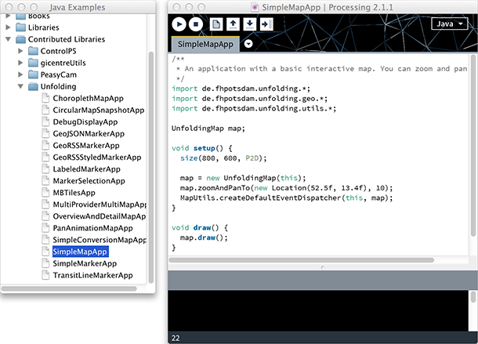
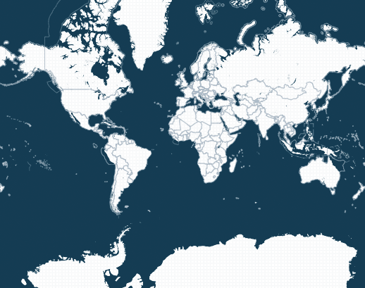



## Download Library
Download the latest version of the [Unfolding library](http://unfoldingmaps.org/downloads "Download Unfolding").
Unzip the archive and put the extracted Unfolding folder into the libraries folder of your Processing sketches.

To find the Processing sketches location on your computer, open the Preferences window of the
Processing application and look for the "Sketchbook location" item at the top.
You will need to create the "libraries" folder if this is your first contributed library.

Restart Processing, start a new sketch and create your first simple map.

## Hello World

To get started, you need to include the Unfolding library via
Sketch » Import Library and put the import statements at the top of your code.

	import de.fhpotsdam.unfolding.*;
	import de.fhpotsdam.unfolding.geo.*;
	import de.fhpotsdam.unfolding.utils.*;  

Create a reference to a “Map” object, i.e.

	UnfoldingMap map;

Initialize a new map object and add the default event function for basic interaction (double-click to zoom  and drag to pan the map).

	void setup() {
		size(800, 600);
		map = new UnfoldingMap(this);
		MapUtils.createDefaultEventDispatcher(this, map);
	}

(You can specify P2D or P3D as renderer as the third parameter of the size() function, and Unfolding will use the appropriate one.)

Once you’ve done this you can begin to draw the map and run the sketch.  

	void draw() {
		map.draw();
	}

You should get something like this.  

That's it. Now you are all set up, and good to go! Check out our other [tutorials](./), and don't forget to browse through the [examples](../examples/).

## Tips & Tricks

### Memory usage
It might be a good idea to increase the memory for Unfolding applications. For this, go to the Processing Preferences, check the box next to "Increase maximum available memory" and enter an amount, e.g. 1024 MB.

