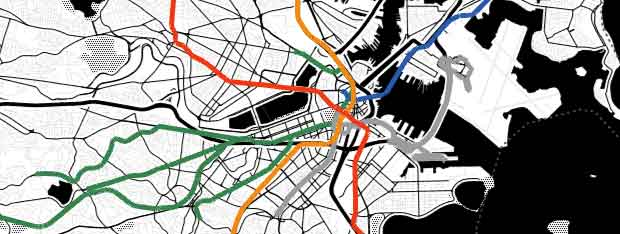



## Reading data files

The following example displays countries of the world as simple polygons. Reads from a GeoJSON file, and uses default marker creation, i.e. features are represented by simple markers in the default style.

	UnfoldingMap map;

	void setup() {
		size(800, 600, GLConstants.GLGRAPHICS);
	
		map = new UnfoldingMap(this);
		MapUtils.createDefaultEventDispatcher(this, map);
	
		List<Feature> countries = GeoJSONReader.loadData(this, "countries.geo.json");
		List<Marker> countryMarkers = MapUtils.createSimpleMarkers(countries);
		map.addMarkers(countryMarkers);
	}

	void draw() {
		map.draw();
	}

Now, you can load data from other formats easily. 

	String rssUrl = "http://earthquake.usgs.gov/earthquakes/catalogs/eqs7day-M5.xml";
	List<Feature> features = GeoRSSReader.loadData(this, rssUrl);
	List<Marker> markers = MapUtils.createSimpleMarkers(features);

The provided data readers support basic functionality, and do not fully implement the respective specifications. The GeoJSON parser supports most features, while the GeoRSS reader supports only Simple and W3C Geo, but not GML, and the GPX reader only enables reading track points. So, either use some other library to parse various data formats with full specification support, or tell us what file you are trying to read in our [issue tracker](https://github.com/tillnagel/unfolding/issues).

(More to come soon on CSV, KML etc)

## Using Shapefiles

Various kinds of geo-data are freely available, and often provided as [Shapefile](http://en.wikipedia.org/wiki/Shapefile). These contain geometries such as points, lines, and polygons, and additional data attributes.

Unfolding does not provide parsing Shapefiles out-of-the-box. You can either use some library to parse those and convert them to Unfolding markers. See for instance [how to read Shapefiles in Java](http://stackoverflow.com/questions/2044876/does-anyone-know-of-a-library-in-java-that-can-parse-esri-shapefiles) by utilizing the [GeoTools library](http://geotools.org/).

Alternatively, you can convert a Shapefile to another format. One easy tool is the [OGR Simple Feature Library](http://www.gdal.org/ogr/) (part of [GDAL](http://www.gdal.org)). After installing it on your machine, you can simply convert geo-data from one format to another, e.g.:

	ogr2ogr -f geoJSON countries.json countries.shp

If you don't want to install that library, you can use the [ogr2ogr web client](http://ogre.adc4gis.com/).

For an example, let's use a Shapefile containing borders of all countries. Download the simplified version from [thematicmapping.org](http://thematicmapping.org/downloads/world_borders.php). Then, go to [ogr2ogr web client](http://ogre.adc4gis.com/), upload that zip file, and convert it to GeoJSON. Save the result as "countries-simple.geo.json" in the data folder of your Unfolding sketch. Now, you simply have to load and use the data to create markers.

	List<Feature> countries = GeoJSONReader.loadData(this, "countries-simple.geo.json");

## Features and Markers

In the examples above, we create default markers automatically from the loaded geo data.
	
	List<Feature> features = GeoDataReader.loadData(this, dataFile);
	List<Marker> markers = MapUtils.createSimpleMarkers(features);

This way, Unfolding creates simple markers in the default style. If you want to change the display style, or have extended functionality you need to create the markers on your own. There are two ways of doing that:

### Specify which markers to create automatically

You can create own markers from features.

	MarkerFactory markerFactory = new MarkerFactory();
	markerFactory.setPolygonClass(MyPolygonMarker.class);
	List<Marker> markers = markerFactory.createMarkers(features);
	map.addMarkers(markers);

See the [Markers tutorial](markers-simple.html) on how to create own marker classes. 

(More details coming soon.)

### Create markers from features manually

		List<Marker> transitMarkers = new ArrayList<Marker>();

		// Load features from GeoJSON
		List<Feature> transitLines = GeoJSONReader.loadData(this, "MBTARapidTransitLines.json");
		
		// Create markers from features, and use LINE property to color the markers.
		for (Feature feature : transitLines) {
			ShapeFeature lineFeature = (ShapeFeature) feature;

			SimpleLinesMarker m = new SimpleLinesMarker(lineFeature.getLocations());
			String lineColor = lineFeature.getStringProperty("LINE");
			int color = 0;
			// Original MBTA colors
			if (lineColor.equals("BLUE")) {
				color = color(44, 91, 167);
			}
			if (lineColor.equals("RED")) {
				color = color(233, 57, 35);
			}
			if (lineColor.equals("GREEN")) {
				color = color(59, 130, 79);
			}
			if (lineColor.equals("SILVER")) {
				color = color(154, 156, 157);
			}
			if (lineColor.equals("ORANGE")) {
				color = color(238, 137, 40);
			}
			m.setColor(color);
			m.setStrokeWeight(5);
			transitMarkers.add(m);
		}

		map.addMarkers(transitMarkers);

See the [MBTA Lines](examples/40_marker-mbta-lines.html) example for the full code.

## Combine geo-spatial data with other data sources

See the [Choropleth Map](../examples/40_choropleth.html) example for how to combine GeoJSON geometry data with population density data from a CSV file by using country codes existing it both files.

(More details coming soon.)

## Generalization & Level of detail

(As you can see, the simplified (i.e. [generalized](http://en.wikipedia.org/wiki/Cartographic_generalization)) border data results in overlaps and gaps between the vector countries and the underlying tiles. Use a high detailed data file to prevent this. For performance boosts, look at our examples AutoGeneralization or ZoomDependentPolygonData.)

## Read from other sources

You can also query geospatial data from other sources, such as databases, or web services.

