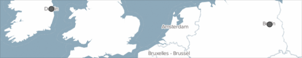
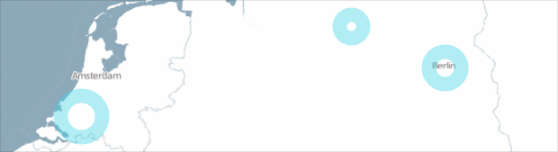
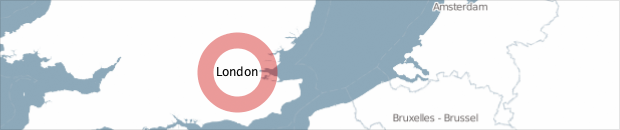
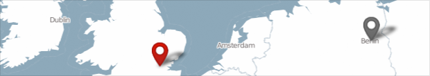



Displaying markers on a map is very straight-forward. Just create a marker with a location and add it to the map once.
Here, for instance, we are creating two point markers, one for Berlin and one for Dublin.

	Location berlinLocation = new Location(52.5, 13.4);
	Location dublinLocation = new Location(53.35, -6.26);
  	
	// Create point markers for locations
	SimplePointMarker berlinMarker = new SimplePointMarker(berlinLocation);
	SimplePointMarker dublinMarker = new SimplePointMarker(dublinLocation);
  	
	// Add markers to the map
	map.addMarkers(berlinMarker, dublinMarker);

They will be drawn automatically on top of the map, always at the correct position.

Unfolding provides a default marker style, and has point, line, and polygon markers out of the box.

## Style your markers

All default markers provide some very basic styling methods, e.g. to set stroke and fill colors.

	// Adapt style
	berlinMarker.setColor(color(255, 0, 0, 100));
	berlinMarker.setStrokeColor(color(255, 0, 0));
	berlinMarker.setStrokeWeight(4);

For more sophisticated marker customization or for creating data glyphs, there are two options:
- Drawing it yourself
- Creating own marker class (advanced)

The easiest method to create a custom style is to draw the marker yourself instead of adding it to the map.

For this you need to make the marker global, i.e. define the variable first in your sketch (here: line 2), then assign a new marker in setup (line 11).
In draw() get the current position of the marker (line 19), and draw some visual representation with Processing's drawing functions (lines 20-23).

	UnfoldingMap map;
	SimplePointMarker berlinMarker;

	void setup() {
	  size(800, 600);

	  map = new UnfoldingMap(this);
	  MapUtils.createDefaultEventDispatcher(this, map);

	  Location berlinLocation = new Location(52.5, 13.4);
	  berlinMarker = new SimplePointMarker(berlinLocation);

	  // Do not add marker to the map
	}

	void draw() {
	  map.draw();

	  ScreenPosition berlinPos = berlinMarker.getScreenPosition(map);
	  strokeWeight(16);
	  stroke(67, 211, 227, 100);
	  noFill();
	  ellipse(berlinPos.x, berlinPos.y, 36, 36);
	}

`marker.getScreenPosition(map)` returns the current x,y-position of the marker on the map. The method converts the geo-location of that marker to the current `ScreenPosition` on the canvas of the sketch.

Now, you can style your markers in any way you want. In the following example we draw the marker as two arcs with a text label.

	ScreenPosition posLondon = markerLondon.getScreenPosition(map);
	strokeWeight(12);
	stroke(200, 0, 0, 200);
	strokeCap(SQUARE);
	noFill();
	float s = 44;
	arc(posLondon.x, posLondon.y, s, s, -PI * 0.9, -PI * 0.1);
	arc(posLondon.x, posLondon.y, s, s, PI * 0.1, PI * 0.9);
	fill(0);
	text("London", posLondon.x - textWidth("London") / 2, posLondon.y + 4);

(By drawing the marker yourself, the marker is rendered after the map. In special cases, such as when using the Processing2D renderer, this can result in slight lags. If you have experienced this you should try the second option: Create your own marker class.) 

## Create your own marker

You can also create your own marker class by extending `AbstractMarker`, which gives you full control over style and interaction handling.

Besides, by creating your own marker class you will have cleaner code, and can manage hundreds of markers with a more elegant software architecture, as the drawing will be handled automatically by the map.

As example, let's say you want to have concentric markers at specific point locations. In Processing, create a new tab (by clicking on the arrow in the right top corner), and name it EarthquakeMarker.java (don't forget the 'java' suffix!). Now, create your own class and extend Unfolding's `SimplePointMarker`. In the draw() method you can use the PGraphics (same as the one you are drawing on in Processing), and the x and y parameters to draw your stuff to.

	import processing.core.*;
	import de.fhpotsdam.unfolding.geo.Location;
	import de.fhpotsdam.unfolding.marker.SimplePointMarker;

	public class EarthquakeMarker extends SimplePointMarker {

	  public EarthquakeMarker(Location location) {
	    super(location);
	  }

	  public void draw(PGraphics pg, float x, float y) {
	    pg.pushStyle();
	    pg.noStroke();
	    pg.fill(200, 200, 0, 100);
	    pg.ellipse(x, y, 40, 40);
		pg.fill(255, 100);
	    pg.ellipse(x, y, 30, 30);
	    pg.popStyle();
	  }
	}

You also can extend SimpleLinesMarker (<a href="https://github.com/tillnagel/unfolding/blob/master/examples/de/fhpotsdam/unfolding/examples/marker/custom/MyLinesMarkerApp.java">example</a>) or SimplePolygonMarker (<a href="https://github.com/tillnagel/unfolding/blob/master/examples/de/fhpotsdam/unfolding/examples/marker/custom/MyPolygonMarkerApp.java">example</a>) or create your completely own.
Check out the [Processing tutorial on objects](http://processing.org/learning/objects/) for more information on objects, classes, etc.

How to create your own image marker in Java, as shown in the screenshot above, see the [Image Marker example](../examples/40_image-marker.html) for the source code.

Check the [Data Markers tutorial](markers-data-geojson.html) on how to use own class with the MarkerFactory to create markers from data automatically.

## Line and polygon marker

You can also create markers for multiple geo-locations. For instance, if you want to show flight paths you could use line markers, and if you want to show neighborhoods in your city you could use polygon markers.

Let's create a very simple line marker connecting two locations.
	
	Location startLocation = new Location(52.5, 13.4);
	Location endLocation = new Location(53.35, -6.26);
	SimpleLinesMarker connectionMarker = new SimpleLinesMarker(startLocation, endLocation);

As the names suggest, a `LineMarker` connects two or more locations with a line, a `PolygonMarker` draws a closed polygon. Both are shape markers handling a list of locations, having a centroid, and providing hit test methods.

For more complex markers with many locations it might be useful to load them from a geo-data source. Check out our [Markers & Data tutorial](markers-data-geojson.html) for this.

And to repeat, you can also extend SimpleLinesMarker (<a href="https://github.com/tillnagel/unfolding/blob/master/examples/de/fhpotsdam/unfolding/examples/marker/custom/MyLinesMarkerApp.java">example</a>) or SimplePolygonMarker (<a href="https://github.com/tillnagel/unfolding/blob/master/examples/de/fhpotsdam/unfolding/examples/marker/custom/MyPolygonMarkerApp.java">example</a>) for further customization, or to implement own behaviour.

## Selecting a marker

Unfolding's simple markers support highlighting. This can be used e.g. for enabling an interactive picking mechanism, or to animate through different markers.

You can manually set the status, and it will be displayed in the default highlight style.

	SimplePointMarker marker = new SimplePointMarker(new Location(52.5, 13.4));
	marker.setSelected(true);

If you want to allow users to interactively select and deselect markers, you need to check which marker the mouse pointer is over currently, and set the status accordingly. For instance, like this:

	public void mouseMoved() {
		Marker hitMarker = map.getFirstHitMarker(mouseX, mouseY);
		if (hitMarker != null) {
			// Select current marker 
			hitMarker.setSelected(true);
		} else {
			// Deselect all other markers
			for (Marker marker : map.getMarkers()) {
				marker.setSelected(false);
			}
		}
	}

NB: You can use the same selection mechanism when creating your own marker classes. Take a look at the LabelMarker example for a marker which displays a text label when selected.

## Multi marker

You can also create markers consisting of multiple sub markers.

The following example shows the shape for France and Corsica, both defined as (crude) polygons. Both areas are `SimplePolygonMarker` and combined in one `MultiMarker`. Only the `MultiMarker` is added to the map.

	// Create markers for each area
	SimplePolygonMarker franceMarker = new SimplePolygonMarker(getFranceShapeLocations());
	SimplePolygonMarker corsicaMarker = new SimplePolygonMarker(getCorsicaShapeLocations());

	// Combine as MultiMarker
	MultiMarker multiMarker = new MultiMarker();
	multiMarker.addMarkers(franceMarker, corsicaMarker);

	// Add only MultiMarker to the map
	map.addMarkers(multiMarker);

As you can see, this works also with interactive selection. When the user moves the mouse over one of the areas, both are highlighted. 

## Fixed and dynamic sized markers

Note that we draw a zoom dependent marker, i.e. the marker will be bigger in zoomed in, and smaller in zoomed out maps.

	// Zoom dependent marker size
	float s = map.getZoom();

## Creating data markers

If you want to load geospatial data from GeoJSON or various other file formats, take a look at our [Data Markers](markers-data-geojson.html), and our [Data Markers 2](markers-data-csv-database.html) tutorials.

