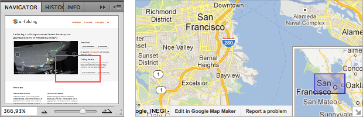



There are different use-cases for displaying multiple maps.

- Adjacent: Independent maps side by side
- Overlay: Synchronized maps over each other
- Connected: Maps with more complex links, e.g. loupe, Overview + Detail, etc.

## Two adjacent maps
Drawing two independent maps in one application is very simple. You just need to create two maps, and place them besides each other.

You can set the x,y position and the width and height of the map by specifying those parameters in the `UnfoldingMap` constructor. 

	map1 = new UnfoldingMap(this, "map1", 0, 0, 295, 300);
	map2 = new UnfoldingMap(this, "map2", 305, 0, 295, 300);
	MapUtils.createDefaultEventDispatcher(this, map1, map2);

Then just draw them both in the `draw` method. That's it, basically. 

	map1.draw();
	map2.draw();

Now, when you run the app, you can interact with two autonomous maps.

Of course, you could change the map style, or add different markers to each map, etc.

## Overlaying two maps

Show two map layers together by displaying two UnfoldingMaps at the same position, with the top one transparent.

	UnfoldingMap map1;
	UnfoldingMap map2;

	void setup() {
		size(800, 600, GLConstants.GLGRAPHICS);
		
		Location berlinLocation = new Location(52.439046f, 13.447266f);
		map1 = new UnfoldingMap(this, "map1", new Microsoft.RoadProvider());
		map1.zoomAndPanTo(berlinLocation, 8);

		map2 = new UnfoldingMap(this, "map2", new ImmoScout.HeatMapProvider());
		map2.zoomAndPanTo(berlinLocation, 8);

		MapUtils.createDefaultEventDispatcher(this, map1, map2);
	}

	void draw() {
		background(0);

		map1.draw();
		tint(255, 100);
		map2.draw();
	}

(If you want to do more sophisticated stuff, you could also create your own MapProvider and combine two or more tiles in there.)

You don't need to do anything special for the interaction, as both are simply reacting to user input in the same way, and thus stay synchronized.

	MapUtils.createDefaultEventDispatcher(this, map1, map2);

If you add the default interaction methods, both maps can be panned and zoomed independently. Direct interactions (such as mouse, or finger touch) work out of the box.

### Special Case: Indirect interactions

But what happens if you want to allow using indirect interactions, such as keyboard or, say, an external rotary knob? How does Unfolding know which map should react to which input? It does not. So it is up to you to create some switching mechanism.
 
As an example, let us use the mouse to select the active map. First, we check which map was hit, i.e. over which map the mouse pointer was when the user pressed a key. Then, that map reacts to the plus and minus keys in zooming in and out.

	public void keyPressed() {
		Map activeMap = null;
		if (map1.isHit(mouseX, mouseY)) {
			activeMap = map1;
		} else if (map2.isHit(mouseX, mouseY)) {
			activeMap = map2;
		}

		if (activeMap != null) {
			if (key == '+') {
				activeMap.zoomLevelIn();
			}
			if (key == '-') {
				activeMap.zoomLevelOut();
			}
		}
	}

## Connected maps

### Loupe

More complex: Window to other map layer.
See the [Looking glass example](../examples/30_provider-satellite-overlay.html) for the full code.

### Overview + Detail

A more complex example is to use two maps which are connected. A typical example is the [Overview + Detail interaction pattern](http://designinginterfaces.com/firstedition/index.php?page=Overview_Plus_Detail). You might know this from Photoshop's navigator window, or from Google Maps.

(More to come soon.)

For now, check out the examples
- [Overview + Detail](../examples/50_overviewAndDetail.html), 
- [Overview + Detail with Viewport](../examples/50_overviewAndDetailViewport.html), and
- [Two Overviews + One Detail](../examples/50_overviewAndDetailViewport2.html).

